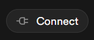
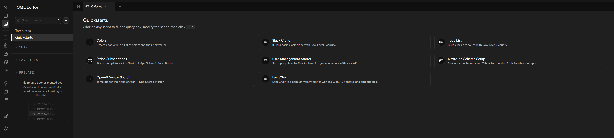

# Ultimate Next.js Starter Kit (Next.js, Supabase, ShadCN)

This is a comprehensive starter kit that combines Next.js, Supabase, and ShadCN to help you build modern web applications faster. It provides everything you need to get started:

- **Next.js 14**: The latest version of the React framework for production-grade applications
- **Supabase Authentication**: Pre-configured auth system with email/password, social logins, and session management
- **Supabase Database**: Postgres database with row-level security and real-time subscriptions
- **Supabase Blob Storage**: Image storage/binary file storage 
- **ShadCN UI Components**: A collection of beautifully designed, accessible components
- **TypeScript**: Full type safety and better developer experience
- **Tailwind CSS**: Utility-first CSS framework for rapid UI development

This template saves you hours of setup time and follows best practices for architecture and security. Perfect for building anything from MVPs to production applications.


## Prerequisites

- **Node.js**: Version 18.17 or later. Download from [nodejs.org](https://nodejs.org/)
- **npm**: This comes bundled with Node.js, but make sure you have version 9.x or later
  - To check your version: `node -v && npm -v`

<br>

# Getting Started

## 1. Install Packages

```bash
npm install
```
<br>

## 2. Supabase setup

### Supabase Environment
1. Login to [Supabase](https://supabase.com/)
2. Setup Organization (Personal/Free Plan works)
3. Setup Database Password
4. Run this command to create env
    
    ```bash
    cp .env.example .env.local
    ```
5. Click `Connect > App Framworks`

    

6. Copy the `.env.local` file into your local `.env.local`

    ```bash
    NEXT_PUBLIC_SUPABASE_URL=YOUR_SUPABASE_URL
    NEXT_PUBLIC_SUPABASE_ANON_KEY=YOUR_SUPABASE_ANON_KEY
    ```

<br>

### Supabase CLI

#### Connect Supabase Project

```bash
supabase link --project-ref <project-id>

# You can get <project-id> from your project's dashboard URL: https://supabase.com/dashboard/project/<project-id>
``` 

#### Database Quickstarts *(Optional)*  

 

 ```bash
 npx supabase db pull
 ``` 
<br>

## Development

```bash
npm run dev
```

Open [http://localhost:3000](http://localhost:3000) with your browser to see the result.

You can start editing the page by modifying `app/page.tsx`. The page auto-updates as you edit the file.

This project uses [`next/font`](https://nextjs.org/docs/app/building-your-application/optimizing/fonts) to automatically optimize and load [Geist](https://vercel.com/font), a new font family for Vercel.

## Deploy to Vercel

[](https://vercel.com/new/clone?repository-url=https%3A%2F%2Fgithub.com%2Fapensotti%2Fultimate-next-starter&env=NEXT_PUBLIC_SUPABASE_URL,NEXT_PUBLIC_SUPABASE_ANON_KEY&envDescription=Required%20environment%20variables%20for%20the%20application.&envLink=https%3A%2F%2Fgithub.com%2FYOUR_USERNAME%2Fultimate-next-starter%2Fblob%2Fmain%2F.env.example)

## Learn More

To learn more about Next.js, take a look at the following resources:

- [Next.js Documentation](https://nextjs.org/docs) - learn about Next.js features and API.
- [Learn Next.js](https://nextjs.org/learn) - an interactive Next.js tutorial.

You can check out [the Next.js GitHub repository](https://github.com/vercel/next.js) - your feedback and contributions are welcome!
